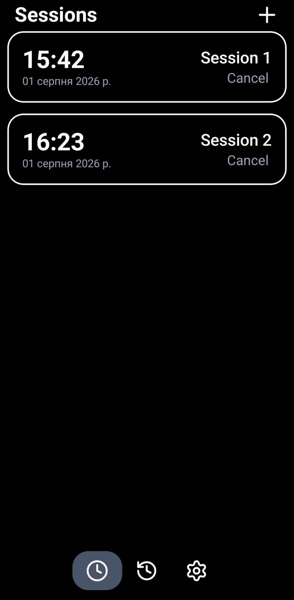
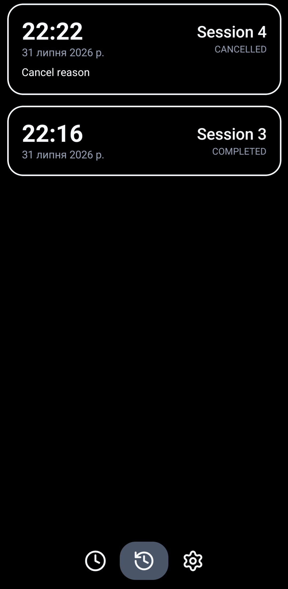
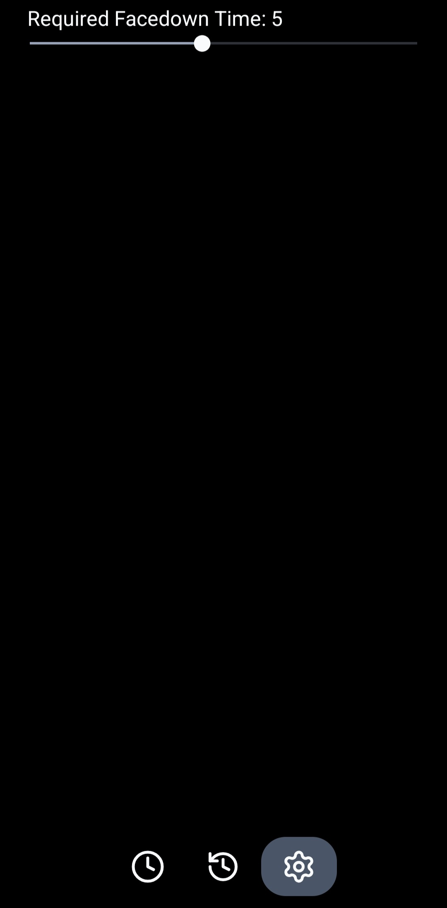

# SidTop - Sit Down To PC

> An Android app that forces you to put your phone down

<p align="center">
   
   
   
</p>

[](https://github.com/fortlis/SidTop/releases)

## Overview

SidTop lets you schedule a session for a specific time. When the scheduled time arrives, the app plays the device's default system alarm sound. The alarm can be stopped in **only** one of two ways:

1. **Tap Cancel and enter a reason** — the session moves to `cancelled` status, and the reason is saved to history.
2. **Flip the phone face-down and hold it for a set duration** — the session automatically moves to `completed` status.

The hold duration for the flip gesture is configurable in the settings screen.

## User Flow

```
[Scheduled] --(time reached)--> [Alarm ringing]
                                      |
                    +-----------------+-----------------+
                    |                                   |
             Cancel tapped                     Phone flipped screen-down
             + reason entered                  and held for N seconds
                    |                                   |
                    v                                   v
              status: cancelled                status: completed
```


## Android Native Layer

- **Scheduling:** `AlarmManager` is used to schedule exact alarm times
    
- **Reboot Handling:** A `BootReceiver` ensures that all scheduled sessions are correctly restored if the device restarts
    
- **Alarm Execution:** When the time arrives, a `BroadcastReceiver` triggers a `ForegroundService`
    
- **Background Work:** The `ForegroundService` is responsible for playing the default system alarm sound
    
- **Motion Detection:** The app listens to sensor data (via `SensorManager`) inside the service to detect when the device is flipped **face-down**.
	
- **Session Handling:** Sessions are temporarily saved in `Datastore`, allowing the native code logic to function even when the JS thread is inactive. Once the JS thread wakes up, the sessions are synchronized, moved to the `SQLite` database, and cleared from `Datastore`.

## Session Statuses

| Status      | How it's reached                                   |
| ----------- | -------------------------------------------------- |
| `scheduled` | Session created, scheduled time hasn't arrived yet |
| `active`    | Scheduled time reached, alarm sound is playing     |
| `cancelled` | Cancel tapped + cancellation reason entered        |
| `completed` | Phone held face-down for the configured duration   |

## Tech Stack

- [Expo](https://expo.dev)
- [Expo Modules API](https://docs.expo.dev/modules/overview/) — custom native module
- React Native
- Kotlin (native side: flip detection via accelerometer, system alarm sound playback, foreground service, datastore)
- Yarn — package manager

## Installation

```bash
yarn install
npx expo prebuild --clean
```

## Running in development

> ⚠️ The app **does not work in Expo Go**, since it relies on a custom native module (Kotlin). A dev client is required.

```bash
npx expo run:android
```

or via EAS:

```bash
eas build --profile development --platform android
```

## Building a release APK

```bash
cd android
./gradlew assembleRelease
```

The APK will be located at `android/app/build/outputs/apk/release/`.

Or via EAS Build:

```bash
eas build --platform android --profile production
```

## Required Android permissions

| Permission                                                  | Why it's needed                                         |
| ----------------------------------------------------------- | ------------------------------------------------------- |
| `USE_EXACT_ALARM`                                           | precise triggering of the session at the scheduled time |
| `RECEIVE_BOOT_COMPLETED`                                    | restoring scheduled sessions after a device reboot      |
| `FOREGROUND_SERVICE`<br>`FOREGROUND_SERVICE_MEDIA_PLAYBACK` | playing the alarm even when the app is backgrounded     |
| `POST_NOTIFICATIONS`                                        | allows the app to send notifications                    |
